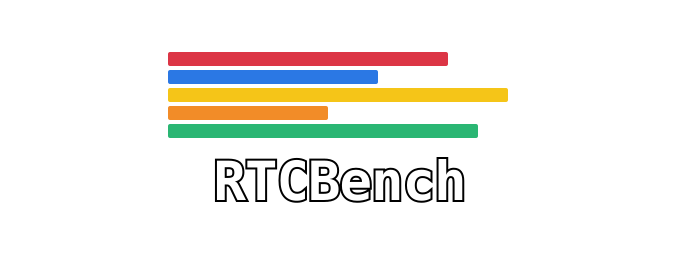

[](https://github.com/rtcbench/rtcbench/actions/workflows/ci.yml)

Benchmark large WebRTC video conferences using lightweight participant bots across multiple platforms (Jitsi, LiveKit, ...). Very light on CPU usage compared to Chrome.


### Getting started

Launch 250 viewer bots with:

```bash
make
./rtcbench config-examples/jitsi/250-viewer-bots.yml
```

[Go 1.25 or newer](https://go.dev) is required.

### Examples

- YAML-first configs live in [`config-examples/`](config-examples), including [`config-examples/churn.yml`](config-examples/churn.yml) for the built-in churn scenario.
- Code-first programmable usage lives in [`examples/`](examples), including [`examples/custom-scenario/main.go`](examples/custom-scenario/main.go).

### Contribution

Created by [Evan Ram](https://linkedin.com/in/evanram) in the [Internet Systems Lab](https://netstech.org) at the [University of Colorado Boulder](https://colorado.edu).

### Legal Disclaimer

This software is intended solely for legitimate testing and research purposes.

The authors and distributors of rtcbench do not condone or support any use of this tool to conduct denial‑of‑service attacks, disrupt services, or otherwise violate the laws of any jurisdiction.  Users are responsible for ensuring that their use complies with all applicable regulations and the terms of service of the target system.

By downloading, building, or running rtcbench, you acknowledge that you understand these restrictions and agree to use the software only in lawful and authorized contexts.
